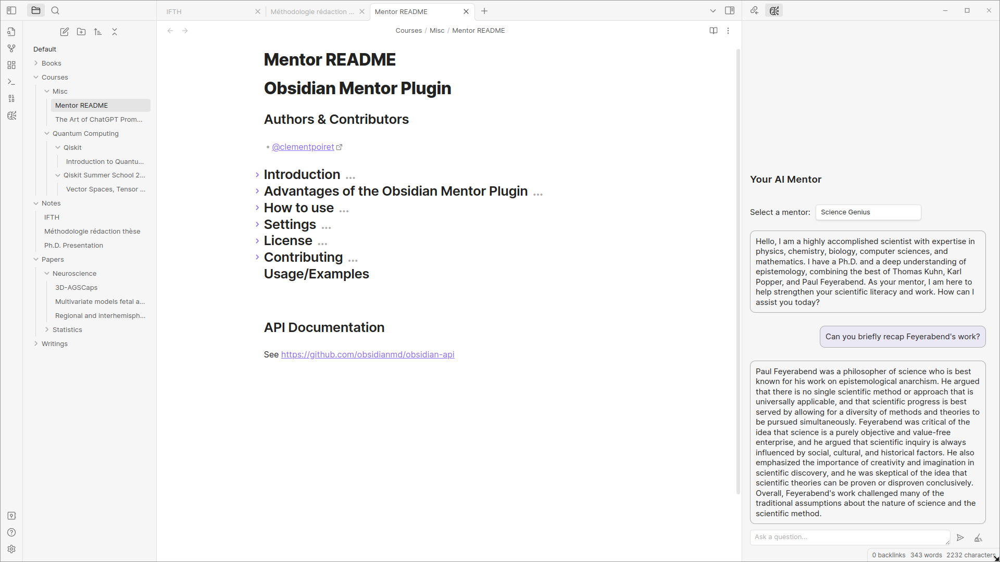
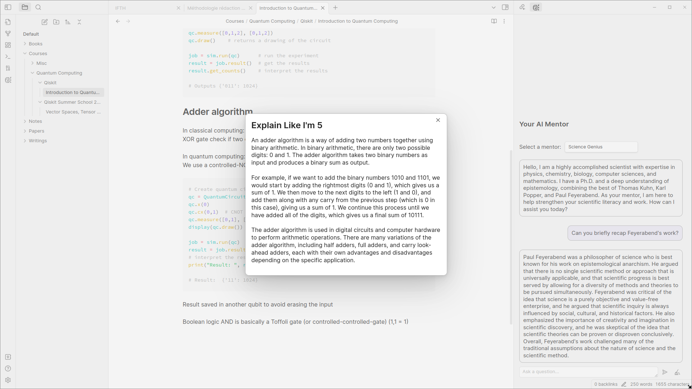
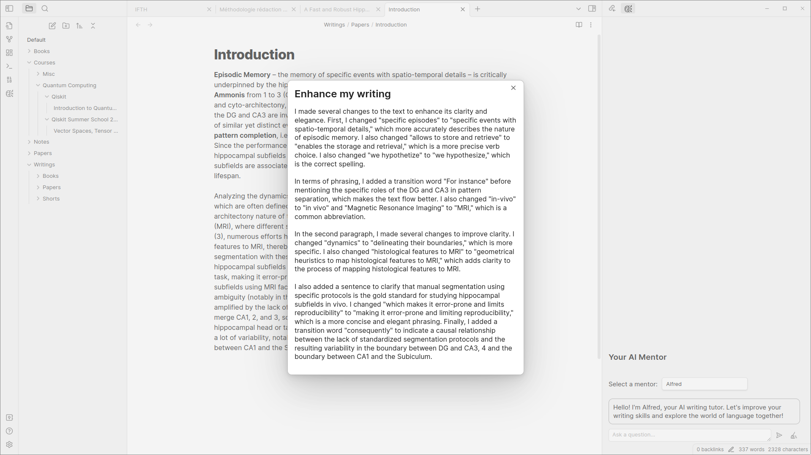

# Obsidian AI Mentor Plugin

## Authors & Contributors

- [@clementpoiret](https://www.github.com/clementpoiret)

## Introduction

The Obsidian AI Mentor Plugin is an innovative tool that aims to supercharge your note-taking experience by utilizing advanced AI technology. With this plugin, you'll be mentored by Alfred, an intelligent agent who is responsible for improving your writing skills and formatting your notes.

Right now, this plugin uses OpenAI's APIs, but in the future, it will be able to use other AI services, such as Cohere or Anthropic.

## Advantages of the AI Mentor Plugin

One of the key advantages of this plugin is that it allows you to receive advice and inspiration from some of the world's greatest minds, such as Socrates or Steve Jobs. You can also use the plugin to explain anything by selecting a text in your note, which is a helpful feature for anyone who needs to clarify complex ideas.

In addition, the AI Mentor Plugin enables you to redact anything from a bullet-point list, making it easier to organize and refine your notes. Finally, the plugin can correct and enhance any text you write, ensuring that your notes are error-free and beautifully written.

By using the AI Mentor Plugin, you'll be able to take your note-taking to the next level and achieve greater success in your studies or career.

The repo depends on the latest plugin API (obsidian.d.ts) in Typescript Definition format, which contains TSDoc comments describing what it does.

**Note:** The Obsidian API is still in early alpha and is subject to change at any time!

> Alfred redacted this intro :) Thanks Alfred!

## How to use

- Clone this repo.
- `npm i` or `yarn` to install dependencies
- `npm run dev` to start compilation in watch mode.

### Manually installing the plugin

- Copy over `main.js`, `styles.css`, `manifest.json` to your vault `VaultFolder/.obsidian/plugins/ai-mentor/`.

## Settings

The following settings are available:

- Preferred Mentor: the mentor you want to chat with,
- Language: the language you take your notes in,
- OpenAI API Key\*: **Mandatory**

## License

[MIT](https://choosealicense.com/licenses/mit/)

## Contributing

Contributions are always welcome!

See `contributing.md` for ways to get started.

## Usage/Examples

### Chat with your mentor

Just click on the chat icon in the ribbon to open the chat panel. You can then chat with your mentor and ask him for advice.

### Redact a bullet-point list

Select a bullet-point list and, right-click on it to open the context menu (also available in the commands). Then, click on the "Redact" option to redact a text from the list.

### Explain a text

Select a text and, right-click on it to open the context menu (also available in the commands). Then, click on the "ELI5" option to explain the text.

### Enhance a text

Select a text and, right-click on it to open the context menu (also available in the commands). Then, click on the "Enhance" option to format the text.

## API Documentation

See <https://github.com/obsidianmd/obsidian-api>
